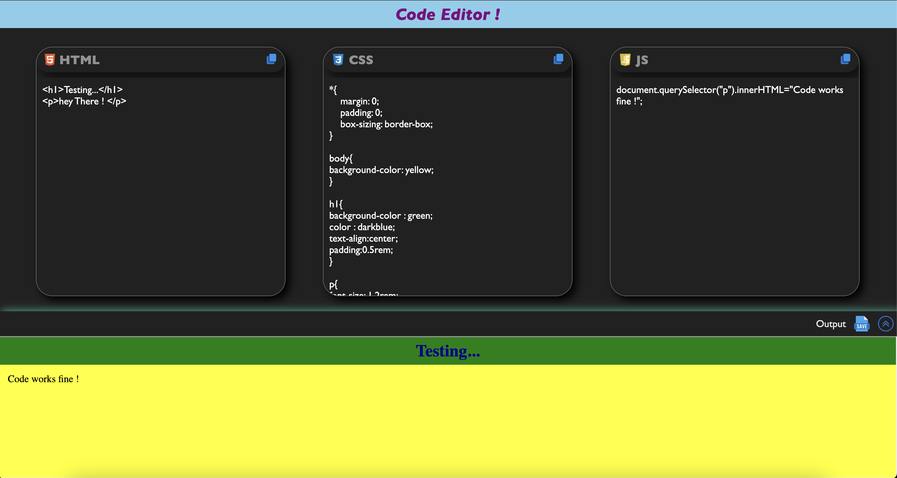

# Code Editor Project
---

## Overview

This is a Code Editor project that allows users to write and test HTML, CSS, and JavaScript code snippets in real-time. It includes an output preview section and several interactive features such as copying code, saving the output, and toggling the preview to full screen.

---

## Screenshort


---

## Features

1. Code Input:

    * Three separate editors for HTML, CSS, and JavaScript.
    * Syntax highlighting and styling for text selection:
        * HTML: Orange highlight
        * CSS: Blue highlight
        * JavaScript: Yellow highlight with black text.

2. Live Preview:

    * A preview pane (iframe) dynamically renders the written code.

3. Copy Code:

    * Buttons to copy code from the respective editors to the clipboard.

4. Save Output:

    * Updates the preview pane with the current code snippets.

5. Full-Screen Mode:

    * Expands the output container for a focused view.
    * Toggle icon rotates based on the container state.
---

## Project Structure

```graph
Project Folder
│
├── index.html          # Main HTML file
├── style.css           # Styling for the project
├── script.js           # JavaScript for functionality
├── html.png            # Icon for HTML editor
├── css.png             # Icon for CSS editor
├── js.png              # Icon for JavaScript editor
├── copy.png            # Icon for copy button
├── save.png            # Icon for save button
└── up-arrows.png       # Icon for fullscreen toggle
```
---

## How to Use

1. `Run the Project`:

    * Open the index.html file in any modern web browser.

2. `Write Code`:

    * Use the respective editors to write HTML, CSS, and JavaScript.

3. `Preview Output`:

    * Click the Save button (📄) to render your code in the output pane.

4. `Copy Code`:

    * Click the Copy button (📋) for the desired editor to copy its contents.

5. `Toggle Full-Screen Mode`:

    * Click the Fullscreen Toggle button (🔼) to expand or collapse the output pane.
---

## Technologies Used

1. Frontend:

    * HTML5
    * CSS3
    * JavaScript (Vanilla JS)

2. Icons and Graphics:

    * PNG images for editor labels, copy buttons, save, and fullscreen toggle.

---

## Setup Instructions

1. Clone the repository or download the files:
```bash
git clone https://github.com/Lovenoelkujur/code-editor.git
cd code-editor
```

2. Open the index.html file in a browser:
```bash
open index.html
```
---

## Future Enhancements

* Syntax Highlighting:

    * Add syntax highlighting using libraries like CodeMirror or Monaco Editor.

* Responsive Design:

    * Improve layout responsiveness for smaller screens.

* Code Persistence:

    * Store the editor content in localStorage to prevent data loss on refresh.

* Error Feedback:

    * Add error detection for JavaScript execution.

* Dark/Light Theme Toggle:

    * Provide theme options for better user experience.
---

## Hosted Link
```bash
https://lovenoelkujur.github.io/code-editor/
```
---

## License

This project is open-source and available under the MIT License.

Feel free to contribute or fork the repository! 😊